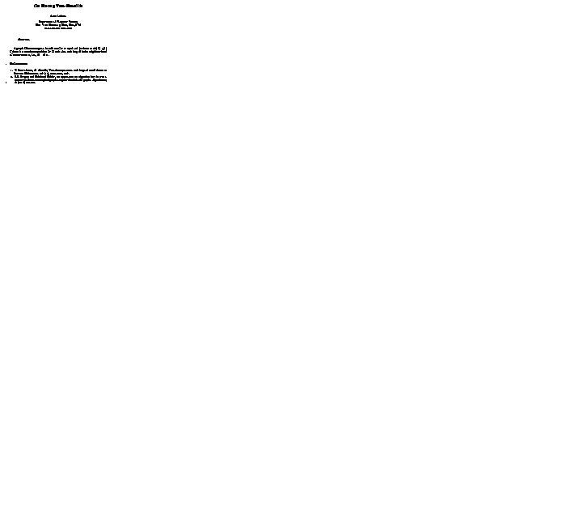

# Paper to Gif

This is a clean(-ish) rebuild of a program I wrote a few years ago.
It takes a git repository of a paper and creates a gif that shows the development of that paper.

The overall approach is as follows.
Determine the commit history of the given repository.
Checkout each commit and compile the code into a PDF.
Each page of the PDF is then converted into a PNG.
These files are then combined into one image that shows all pages.
Lastly, the images of all versions are combined into one gif.

## Requirements

The program is written in C# and meant to run on Linux using mono.
The following programs/commands are used:

- composite
- convert
- cp
- gifsicle
- git
- latexmk (with pdflatex)
- mkdir
- mktemp
- mv
- rm
- sha1sum
